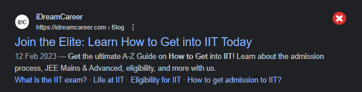
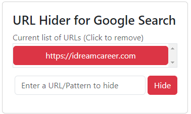
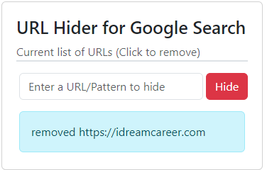

# URL Hider for Google Search

> Sp1d3R | 2024

## Description

Hides URLs with a custom filter list

Clicking the above "X" mark will add the URL to the block list

The above window is obtained on clicking the extension icon.

The URL is added to the filter list.

The text box (above) can be used to add a link to the filter list.

Clicking the URL would remove the link.

## TODO List

* Handle `People also ask section`
* Handle `Related searches`

## Finished

* Handle changes to `#search`
    * thereby handle improper loads
* Reload page on filter list change
* Make UI (Use bootstrap)
* Write to persistent storage
* Add (+) and (-) icons `on hover` to links

## Ignore

* Leave `Generative AI`
* Leave `Top stories`
* Leave upgrade to `MV3`
